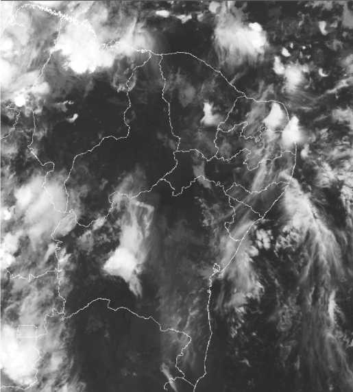
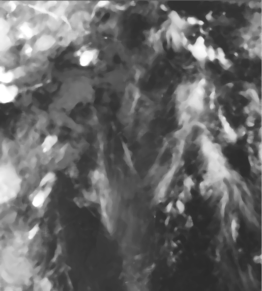
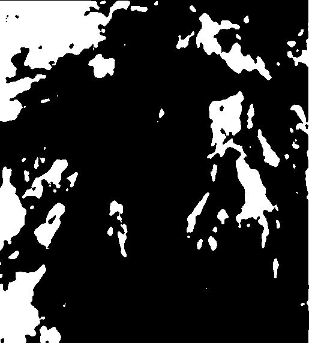

# Cloud Directions Study

Francisco Wilson Rodrigues Júnior wilson.rodrigues@fied.edu.br

> This research is focused on discovery the cloud directions along the time and it could be calculated
using image processing techniques in order to identify the route and directions of the clouds.

## Abstract

<b>Introduction:</b> The cloud studies are very complex and involve many questions about the weather, cloud directions, cloud velocities or cloud types and cloud status. It is important to forecast the future weather inside the specific regions like to understand the weather status.

## 1. Introduction

### 1.1 Problems

### 1.2 Research Questions

## 2. Goals

This work is focused on detect the path and direction of the clouds based on a sequence of pictures in specific periods of the day.

### 2.1 Specific Goals

- To acquire digital images from satelites.
- To use image processing techniques as filters, segmentation and math morphology.
- To identify clouds along many pictures based on cloud features.
- To compute the path and direction of the clouds.

## 3. Related Works

## 4. Background

### 4.1 Weather and Clouds

### 4.2 Image Processing

#### 4.2.1 Filter

#### 4.2.2 Segmentation

#### 4.2.3 Morphology

##### 4.2.3.1 Erosion

##### 4.2.3.2 Dilation

##### 4.2.3.3 Opening

##### 4.2.3.4 Closing

### 4.3 Contour Areas

### 4.4 OpenCV

## 5. Methodology

## 6. Analysis and Results

## 7. Future Works

## References
