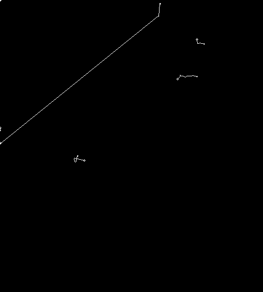

# Cloud Directions Study
- Main Author: Francisco Wilson Rodrigues Júnior
- Date: March 6th 2023 16:07

> This research is focused on discovery the cloud directions along the time and it could be calculated
using image processing techniques in order to identify the route and directions of the clouds.

## Abstract
<b>Introduction:</b> The cloud studies are very complex and involve many questions about the weather, cloud directions, cloud velocities or cloud types and cloud status. It is important to forecast the future weather inside the specific regions like to understand the weather status. 

## Introduction

### Problems

### Research Questions

### Goals

## Literature Review

## Background

### Weather and Clouds

### Image Processing

#### Filter

#### Segmentation 

#### Morphology

##### Erosion

##### Dilation

##### Opening

##### Closing

### Contour Areas

### OpenCV

## Methodology

## Analysis and Results

## Future Works

## References